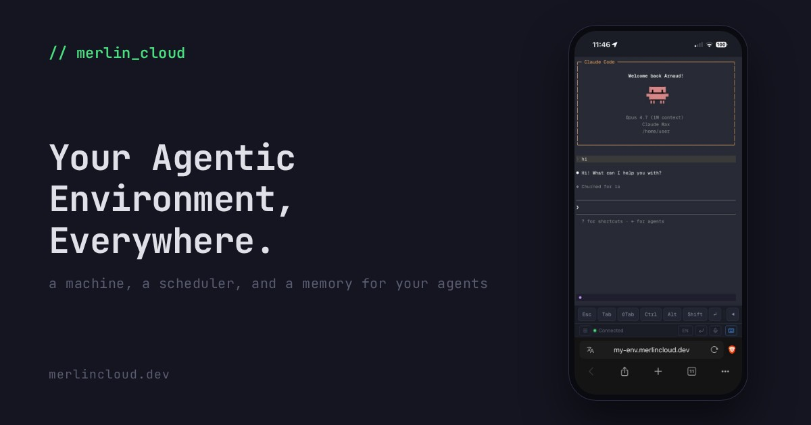
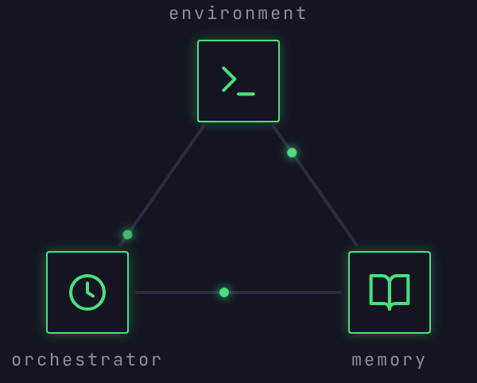

<!-- Rendered from the OG card (portal/templates/og-card.html in the merlin-saas repo); recapture when the card changes. -->


# Merlin

**Give your agents a machine of their own.**

Merlin is an agent operating environment: the place where your AI agents
work. It turns any Linux box or Mac into that place: a real shell, real
files, real git, in your browser, for the agents you already use (Claude
Code, OpenCode, Gemini, Codex: anything that runs in a terminal). You run
it on one machine and control it from any other, phone included. Open
source and self-hosted first; [Merlin Cloud](https://merlincloud.dev) is
the hosted version.

## The three pillars

Merlin doesn't ship its own AI; it gives your agents a place to operate:
a machine, a scheduler, and a memory.

<!-- Captured from the landing's Three Pillars section (portal/templates/landing.html, .tp-stage, in the merlin-saas repo); recapture when the diagram changes. -->
<p align="center"></p>

- **A coding environment**: a terminal with your agents in it, the
  filesystem, and the git history, all in the browser, built for the way
  you work now: the agent types, you direct, review, and decide from
  whatever screen is in your hand. Talk instead of typing: voice input
  with built-in transcription works in the terminal and the chat. The
  **Discord bot** puts the same agent in your pocket.
- **Agent orchestration**: jobs that run without you, fired by a
  schedule or a webhook. A job is a script or an agent, and reports land
  back in your chat.
- **A living knowledge base**: markdown notes you and your agents both
  read, write, and curate. Every channel feeds the same memory, so the
  longer Merlin runs, the more your agents know.

**Extensions and skills** bolt new pages, commands, and know-how onto all
three.

## Quick start

```bash
curl -fsSL https://raw.githubusercontent.com/ArnaudValensi/merlin/master/install.sh | bash
merlin setup    # password, optional Discord bot and voice transcription
merlin          # start the dashboard
```

Open **http://localhost:3123**. The full walkthrough, including reaching
it from your phone (bring your own tunnel, or let
[Merlin Cloud](docs/getting-started.md#merlin-cloud) handle remote
access), updating, and rolling back, is in
[Getting started](docs/getting-started.md).

## Documentation

Start here, then one doc per piece of Merlin:

- [Getting started](docs/getting-started.md): install, setup, first run, phone access, update and rollback
- [Terminal](docs/terminal.md): the web terminal, touch gestures, mobile toolbar, clipboard, voice input
- [Files](docs/files.md): file browser, code viewer, image and 3D model preview
- [Commits](docs/commits.md): git history and diffs, review your agent's work from your phone
- [Notes](docs/notes.md): the notes editor and your agent's memory (user facts, daily logs, knowledge base)
- [Cron](docs/jobs.md): scheduled agent runs, reports, history and performance
- [Discord bot](docs/bot.md): the same agent in your chat, threads, voice messages
- [Extensions](docs/extensions.md): enable, configure, and audit what your agent can do
- [Your agent](docs/agents.md): running Claude Code or OpenCode with Merlin's skills and memory
- [Creating extensions](docs/creating-extensions.md): add your own dashboard pages, `merlin` commands, and agent skills
- [The merlin CLI](docs/cli.md): drive everything from the shell; the command map, with syntax in `merlin --help`
- [Contributor docs](docs/dev/development-setup.md): working on Merlin's code; setup and tests first, then [architecture](docs/dev/architecture.md) and the per-system internals
