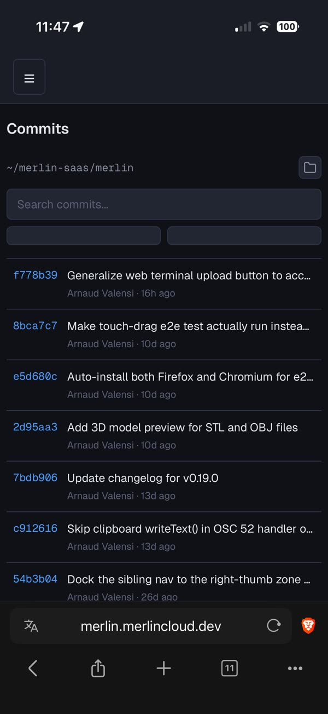
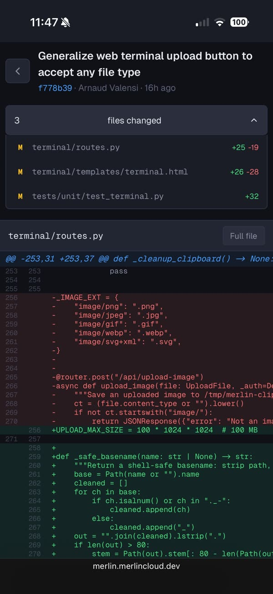

# Commits

The Commits page (sidebar: **Commits**, route `/commits`) is a read-only
git history browser: a commit list with search and date filters, colored
unified diffs, and a full-file view with change gutters and syntax
highlighting. It shows one repository at a time and defaults to wherever
your terminal session is working, so this is where review happens:
your agent codes in the [web terminal](terminal.md), and Commits is where
you inspect what actually landed, from the same dashboard, phone included.

## Browse the history

Each row shows the short hash (blue, monospace), the one-line message,
the author, a relative time ("5m ago"), and the +insertions/-deletions
counts in green and red. Tap a commit to open its diff. Commits load 50
at a time; a **Load more** button appears at the bottom when there are
more to fetch.

## Search and filter

The search box filters commit messages as you type (case-insensitive
regex, `git log --grep` under the hood, debounced so it does not fire on
every keystroke). The **Since** and **Until** date inputs map to
`git log --since` / `--until` and reload the list when changed.

## Read a diff

The diff view header shows the commit's message, short hash, author, and
relative time. A collapsible "N files changed" panel lists each file with
a status letter (M modified in yellow, A added in green, D deleted in
red, R renamed in purple), its path, and +/- stats; tapping a file
scrolls to its diff section. Diffs render with old/new line numbers,
additions tinted green, deletions red, context dimmed. Binary files show
a "Binary file" notice instead of a diff.

The back arrow returns from the diff to the list (and from a file back to
the diff). Browser back/forward works too.

## Open the full file

Each diff section has a **Full file** button (hidden for deleted files)
that opens the complete file as it existed at that commit, with syntax
highlighting picked from the file extension (auto-detect fallback).
Tapping a hunk header (the `@@` line) also jumps into the full file,
scrolled to that hunk, with diff mode already on.

In the file view:

- A thin colored gutter marks changed lines: green added, red deleted (at
  the nearest line), blue modified. Changed lines get a matching
  background tint.
- The floating prev/next arrows (bottom-right) cycle through the change
  hunks with an `n/m` counter, centering each one on screen.
- The **Diff** button in that floating cluster reveals deleted lines
  inline as red rows. Off by default.
- The **Wrap** button in the header toggles long lines between horizontal
  scroll and wrapping.

## Switch repositories

The repo indicator at the top shows the current repo path (shortened to
`~/...`). Its folder button opens a picker: browse directories with
breadcrumbs (git repos get a green branch icon) and hit **Use this
folder** (it snaps to the enclosing git root), or just type to
search every git repo under your home directory by name (found with
`fd`; plain substring match).
Escape or tapping outside closes it.

On first open, Merlin resolves a default repo in this order:

1. The `?repo=` URL parameter.
2. The last repo you used here (remembered by the browser).
3. Your active terminal pane's working directory, if it is a git repo.
4. The directory where `merlin` was launched.
5. Failing all of that, an empty state with a **Pick a project** button.

So by default you are reviewing exactly the repo your terminal session is
working in.

## Share deep links

URLs are real routes: `/commits?repo=...`, `/commits/<hash>?repo=...`,
and `/commits/<hash>/file/<path>?repo=...`. Bookmark them, or paste one
in chat to point your agent (or a friend) at a specific commit.

## Mobile notes

- The commit list hides the +/- stats on narrow screens to save width.
- Code blocks go edge-to-edge and page padding drops to zero, so the diff
  gets the full screen width.
- Diff tables scroll horizontally with touch momentum while the file
  header stays put.
- The prev/next cluster shrinks and tucks into the corner; commit rows
  and buttons keep 44px tap targets.
- The repo picker opens as a full-height sheet on the phone (a centered
  modal on desktop).

## Troubleshooting

- **"No repository selected"**: none of the defaults resolved (no URL
  param, no saved repo, terminal CWD not a git repo, launch directory not
  a git repo). Hit **Pick a project** and choose one.
- **"Not a git repository: \<path\>"**: you pointed the page at a plain
  directory. The picker only enables the **Use** button inside a git
  root, so this mostly happens with a hand-typed `?repo=` URL.
- **A previously used repo disappeared**: if the saved repo no longer
  exists (or is no longer a repo), it is silently dropped and the default
  chain continues. Just pick it again.
- **"No commits found"**: your search or date filter matches nothing, or
  the repo has no commits yet. Clear the filters.
- **Repo search returns nothing**: fuzzy search shells out to `fd`.
  Merlin checks for it at startup and refuses to start without it, so in
  a running instance the search works; if you see an `fd` error, finish
  installing the dependencies it asked for.
- **404 opening a file**: the file does not exist at that commit (it was
  added later or lived elsewhere). Paths with unusual characters, leading
  slashes, or `..` are also rejected.
