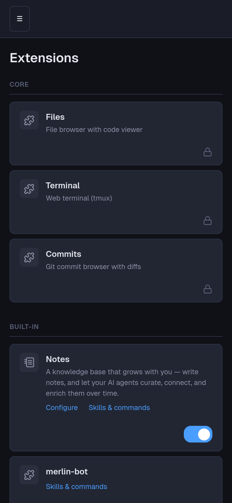

# Creating Extensions

How to extend Merlin with your own commands, skills, and (optionally) web
pages. You never need to read Merlin's source to follow this guide; if you
end up changing Merlin itself, switch to the contributor docs in
[`docs/dev/`](dev/extension-system.md).

This guide is written for humans and agents alike. The most frequent
extension author is an agent asked to "build me an extension that does X";
everything below works from a shell with no prior context.

## The model in one minute

An extension is a directory under `~/.merlin/extensions/`. Its name is the
extension id, and the id is the command namespace:

```
~/.merlin/extensions/tasks/
├── commands/            # executable files -> merlin tasks <name>
│   ├── add.py           # -> merlin tasks add
│   └── recap.py         # -> merlin tasks recap
├── skills/              # SKILL.md folders -> agent skills
│   └── tasks/
│       └── SKILL.md
└── tasks.py             # optional: web pages (FastAPI router)
```

Everything is discovered by the filesystem alone: no manifest, no
registration step, no server restart for commands. Drop a directory in
place and `merlin <id> <command>` works.

Two rules carry the whole system:

- **CLI as API.** Every capability an extension offers is a command that
  works from any directory and self-documents via `--help`. Agents, the
  web UI, scripts, and other extensions all call the same commands; there
  is no second interface to keep in sync. Print JSON when the output is
  data (machine callers pipe it), text when it is for a human.
- **Conventions over declarations.** Folders (`commands/`, `skills/`) are
  the contract. Anything not in a conventional folder is invisible to
  Merlin.

## Commands

A command is any executable file in `<ext>/commands/`. The filename
(without extension) is the command name: `commands/add.py` becomes
`merlin tasks add`.

Requirements, all enforced at dispatch:

- The file must have the executable bit (`chmod +x`); a non-executable
  file produces an error telling you exactly that.
- Files starting with `_` or `.` are never commands (keep helpers there).
- The shebang decides how the file runs. Python commands use uv with a
  PEP 723 inline block, so dependencies resolve lazily on first run and
  never touch Merlin's environment:

```python
#!/usr/bin/env -S uv run --script
# /// script
# dependencies = ["httpx"]
# ///
"""Add a task to the list.

The first docstring line above is the one-line help shown by
`merlin --help`. The rest is yours.
"""
import argparse
...
```

- **One-line help** comes from the first line of the module docstring,
  extracted without executing the file. Non-Python executables can
  provide it with a `# Description: ...` comment line.
- **Detailed help is the command's own job**: `merlin tasks add --help`
  passes `--help` through to your script, which answers via its own
  argparse. Write real help text with examples; for agents, `--help` is
  the documentation.
- Arguments, stdin/stdout, and exit codes pass through untouched.
- Python pitfall: a command file named after a stdlib module it imports
  shadows that module (a `random.py` that does `import random` crashes).
  Pick a filename that is not on your own import list.

Namespacing is solved by construction: each extension owns exactly its
own id, and two extensions cannot collide because directory names are
unique. Core command names (`start`, `agent`, `cron`, `chat`, `config`,
`skills`, ...), built-in extension ids (`notes`, `merlin-bot`, ...), and
the curated aliases (`kb`, `remember`) are reserved: an extension claiming
one is rejected with a clear error at dispatch and at server load.
Top-level aliases are a built-in privilege; installed extensions always
live under their namespace.

**The production model to copy** ships with Merlin: the notes built-in's
commands at `notes/commands/` (`kb.py`, `remember.py`, `search.py` in the
Merlin app directory, `merlin config app-dir`). They show the shebang, the
PEP 723 block, the docstring style, argparse with subcommands, and
JSON-when-piped output.

## Skills

A skill is progressive-disclosure knowledge for agents: a folder with a
`SKILL.md` whose frontmatter carries a `name` and a `description`. The
agent sees the one-line description in its catalog and reads the body on
demand when the task matches. Keep each frontmatter field on a single
line; the parser reads one-line values and drops wrapped continuations.

```
skills/tasks/SKILL.md
---
name: tasks
description: Manage the task list. Use when the user asks to add, list, or complete tasks.
---

# Tasks skill

To add a task: `merlin tasks add "..."`.
...
```

Put skills in `<ext>/skills/`; they are picked up when the extension is
enabled and aggregated into the agent-facing skill set automatically.
`merlin skills` lists every skill and its source. Two things to know:

- **Precedence is core > extension > user, and core skills cannot be
  shadowed.** If your skill's name collides with a core skill it is
  dropped with a logged warning; pick another name.
- **Personal skills** (not tied to any extension) live in
  `~/.merlin/skills-user/` (`merlin config skills-user-dir`), one
  `<name>/SKILL.md` folder each. Same format, lowest precedence,
  per-environment.

Skill bodies should follow CLI-as-API: instruct the agent to call your
extension's commands, never to run files inside your extension by path.
Registry mechanics (aggregation, per-engine adapters, shims) are
documented for contributors in [`docs/dev/skill-system.md`](dev/skill-system.md).

## Web pages (optional, in-process)

An extension that wants dashboard pages exports a FastAPI router from a
Python module named after the extension (`tasks/tasks.py`, hyphens become
underscores):

- `router` (required for pages): a FastAPI `APIRouter`.
- `NAV_ITEMS` (optional): sidebar entries, `[{"url", "icon", "label"}]`.
- `STATIC_DIR` (optional): static assets directory.
- `EXTENSION_META` (optional): `{"name", "description", "icon",
  "config_fields"}`. This is the server-side identity card: it feeds the
  Extensions page listing and declares config fields (key, label, type,
  secret, required) that the Settings page renders and persists.
- Hooks (optional): async `start()` at boot, async `on_tunnel_url(url)`
  when the public URL is known.

Enable, disable, and audit extensions on the `/extensions` dashboard
page; state persists in `~/.merlin/extensions.json`. The page also lists
each extension's skills and commands read-only: that listing is the
security surface, since both are code.



Installed extensions appear in their own group on the same page, with the
same card pattern (toggle, Configure when `config_fields` are declared,
and the Skills & commands audit link).

**Dependency rule for in-process code**: the router module runs inside
Merlin's server process and is restricted to Merlin's own dependencies
(FastAPI, Jinja2, httpx, stdlib). Anything heavier belongs in
`commands/` scripts where PEP 723 gives you any dependency you want
without polluting the server. If your extension is mostly logic, skip
the web part entirely; commands plus a skill is a complete extension.

## Scheduled work

Recurring jobs are managed through the cron CLI, from anywhere:

```bash
merlin cron add --id tasks-recap --schedule "0 18 * * *" \
  --prompt "Run 'merlin tasks recap' and summarize the result."
merlin cron list
```

Jobs live in `~/.merlin/cron-jobs/` as JSON files. Automatic discovery
of a `cron-jobs/` folder inside extensions is not implemented yet; have
your setup instructions (or your agent) register jobs via `merlin cron
add`. `merlin cron --help` is the full reference.

## Worked example: a quotes extension

Everything below is copy-pasteable and takes about two minutes. It
creates an extension that stores favorite quotes and serves them back,
with a skill so agents know it exists.

```bash
EXT=~/.merlin/extensions/quotes
mkdir -p "$EXT/commands" "$EXT/skills/quotes"

cat > "$EXT/commands/add.py" <<'EOF'
#!/usr/bin/env -S uv run --script
# /// script
# dependencies = []
# ///
"""Add a quote to the collection."""
import argparse
import json
import pathlib

STORE = pathlib.Path(__file__).resolve().parent.parent / "data" / "quotes.jsonl"


def main() -> None:
    parser = argparse.ArgumentParser(
        description="Add a quote to the collection.",
        epilog='Example: merlin quotes add "Stay hungry." --by "S. Jobs"',
    )
    parser.add_argument("text", help="The quote text")
    parser.add_argument("--by", default="unknown", help="Who said it")
    args = parser.parse_args()

    STORE.parent.mkdir(parents=True, exist_ok=True)
    with STORE.open("a") as f:
        f.write(json.dumps({"text": args.text, "by": args.by}) + "\n")
    print(f"Saved. {sum(1 for _ in STORE.open())} quotes in the collection.")


if __name__ == "__main__":
    main()
EOF

cat > "$EXT/commands/pick.py" <<'EOF'
#!/usr/bin/env -S uv run --script
# /// script
# dependencies = []
# ///
"""Print a random quote from the collection."""
import argparse
import json
import pathlib
import random
import sys

STORE = pathlib.Path(__file__).resolve().parent.parent / "data" / "quotes.jsonl"


def main() -> None:
    parser = argparse.ArgumentParser(
        description="Print a random quote from the collection."
    )
    parser.add_argument("--json", action="store_true", help="Machine output")
    args = parser.parse_args()

    if not STORE.exists():
        sys.exit("No quotes yet. Add one: merlin quotes add \"...\"")
    quotes = [json.loads(line) for line in STORE.open()]
    quote = random.choice(quotes)
    if args.json:
        print(json.dumps(quote))
    else:
        print(f"\"{quote['text']}\" — {quote['by']}")


if __name__ == "__main__":
    main()
EOF

chmod +x "$EXT/commands/"*.py

cat > "$EXT/skills/quotes/SKILL.md" <<'EOF'
---
name: quotes
description: Store and recall the user's favorite quotes. Use when the user shares a quote worth keeping or asks for one back.
---

# Quotes skill

- Add a quote: `merlin quotes add "<text>" --by "<author>"`
- Get a random one: `merlin quotes pick` (add `--json` for data)

Both commands work from any directory. Run them with `--help` for
details.
EOF
```

Try it:

```bash
merlin --help            # "Installed extensions" now lists quotes add/pick
merlin quotes add "Make it work, make it right, make it fast." --by "Kent Beck"
merlin quotes pick
merlin quotes pick --json
merlin skills            # the quotes skill is listed under its source
```

The skill aggregates at the next server startup (or `merlin setup`);
commands work immediately. That is the whole lifecycle: no manifest, no
build step, and deleting the directory uninstalls it, data included
(the example keeps its data file inside the extension folder).

## Checklist

- [ ] Directory name = extension id, not a reserved name
- [ ] Commands executable, shebang + PEP 723, one-line docstring help
- [ ] `merlin <id> <cmd> --help` answers with real help and examples
- [ ] Data output available as JSON for machine callers
- [ ] Skill description says when to use it; body calls your commands
- [ ] In-process module (if any) sticks to Merlin's dependencies
- [ ] Nothing depends on the current working directory
