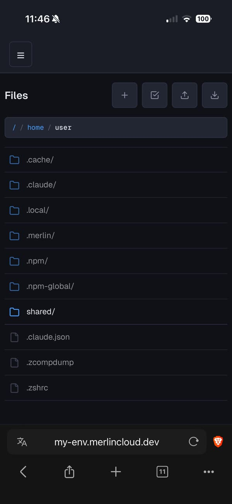
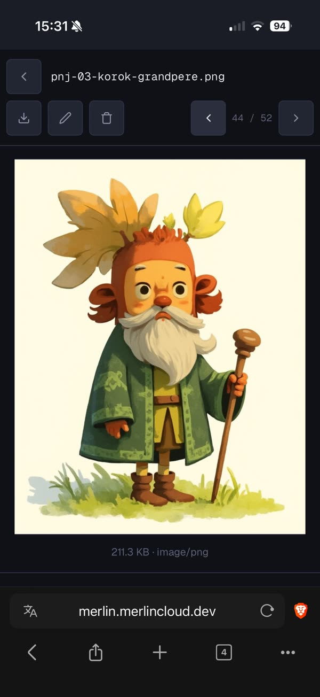
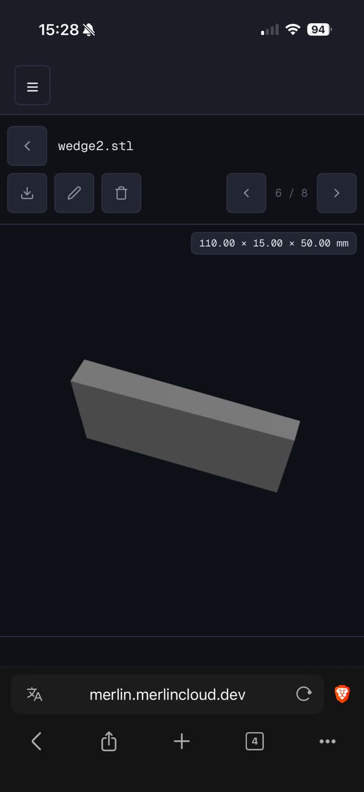

# Files

The Files page (**Files** in the sidebar, `/files`) is a web file browser
over your machine's whole filesystem: a directory listing plus a file
viewer that renders code with line numbers and syntax highlighting,
markdown and Mermaid diagrams, images, audio, video, and 3D models, and
lets you upload, download, create, rename, and delete. It is the
inspection side of the coding environment: your agent produces artifacts
in the workspace (code, screenshots, docs, 3D models) and Files is how
you review them from any device; upload closes the loop the other way,
dropping assets in for your agent to act on. It opens in the same
directory where `merlin` was launched, shared with the
[Terminal](terminal.md) and [Commits](commits.md).

## Browse directories

Tap a row to enter it. Folders come first, then files, case-insensitive
alphabetical; each row shows a type-specific icon, name, size, and
modified time. Dotfiles are never hidden, just dimmed. Breadcrumbs at the
top are clickable on every segment including `/`, and the browser back and
forward buttons work. Any path deep-links: a `/files/<path>` URL opens
that directory or file directly. The page remembers your last directory
and reopens it next visit (the filesystem root is never restored); the
first visit opens the launch directory.

Rows are native browser links. A normal click keeps the fast in-page
navigation, while middle-click, Ctrl/Cmd-click, Shift-click, and the browser's
link context menu can open a file or directory elsewhere without leaving the
current listing. The play icon on an audio row remains a separate inline
audition control, and rows stop being links while selection mode is active.

## Open and read files

Tap a file to open it. Text and code render as a line-numbered table with
syntax highlighting (by extension, with auto-detect fallback); a **Wrap**
button toggles line wrapping. Markdown (`.md`, `.markdown`) renders by
default: GFM, embedded Mermaid code blocks drawn as diagrams, relative
images shown inline, relative links navigating within the browser,
external links opening in a new tab, and clickable heading anchors. A
**Raw** toggle switches to plain text. `.mmd` files render as a Mermaid
diagram with the same toggle.

## Preview media and 3D models

Images (`.png .jpg .jpeg .gif .svg .webp .bmp .ico`) preview inline with
their size and MIME type. Audio and video play with native player
controls, and playback pauses when you go back to the listing. `.stl` and
`.obj` files open in an interactive 3D viewer: rotate and zoom with orbit
controls, with a pill showing dimensions as W x D x H in mm.

## Step through a directory

When a directory has more than one file, the viewer header shows prev/next
buttons and an `n / m` counter. ArrowLeft/ArrowRight step too, and on
media and binary previews a horizontal swipe does the same. At the first
or last file the button shakes. Escape takes you back to the listing.

## Download

The download button in the viewer header downloads the open file; binary
files show a dedicated info card with a Download button instead of a
preview. In a directory listing, the header download button streams the
whole directory as a zip (hidden at `/`), with a "Zipping ..." progress
indicator while the server prepares it.

## Upload

The upload button (or the **Upload** shortcut in an empty directory)
uploads one or more files into the current directory, with a per-file
progress bar and, for multiple files, an `i / n · name` counter. Careful: uploading a name that
already exists silently overwrites it.

## Create, rename, delete

The **+** button opens a "New file / New folder" dropdown, then an inline
name input: Enter or the check confirms, Escape or the X cancels. Empty
directories offer "Create a file" and "Upload" shortcuts. The select
button enters selection mode with per-row checkboxes, a count, and actions
to download (zipped when multiple items or a folder are selected), rename
(only with exactly one item selected), or delete. Rename is inline, in
selection mode or via the pencil button in the file viewer, and stays
within the same directory. Delete shows a confirmation bar first, with
"(includes folders and contents)" when folders are selected; folders are
deleted recursively.

## Jump to Commits

Whenever the current directory is inside a git repo, a git-branch button
appears in the header and opens the [Commits](commits.md) page for that
repo.

## Mobile notes

- All header and toolbar buttons grow to the 44px touch-target minimum.
- Rows show only icon and name; the size and time columns are hidden.
- Swipe left/right on image, audio, video, and binary previews to move
  between files; swipes starting on the player controls are ignored, so
  seeking still works.
- In the file viewer the prev/next cluster docks to the right, in thumb
  reach, on its own row below the filename.
- Long filenames truncate to one line with an ellipsis.
- The 3D viewer blocks page scrolling while you rotate the model and
  shrinks to fit the viewport.
- Code blocks, images, and markdown go edge-to-edge.

## Troubleshooting

- **"Access to ... is not allowed"**: `/proc`, `/sys`, and `/dev` are
  blocked by design.
- **"Permission denied: <path>"**: the directory is unreadable by the user
  running merlin. Unreadable entries inside a readable listing still
  appear, but with an unknown type and no size or time.
- **A text file cuts off with a notice**: files over 2 MB are truncated in
  the viewer; use the "Download full file" link for the rest.
- **"Already exists: <name>"**: create and rename refuse to clobber an
  existing name. (Upload does not: it overwrites silently.)
- **"Cannot modify system path"**: renaming or deleting `/` or a top-level
  directory like `/home` is refused.
- **A zip download died**: leaving the page (sidebar navigation, refresh,
  tab close) aborts a zip in progress; the browser warns before you leave.
  Navigating within Files is safe.
- **A 3D model shows the binary info card**: the model failed to load or
  the 3D module did not; download it instead.
- **"Mermaid rendering failed"**: the diagram source is shown raw below
  the error so you can fix it.
- **The page suddenly reloads to the login screen**: your session expired;
  log back in.
