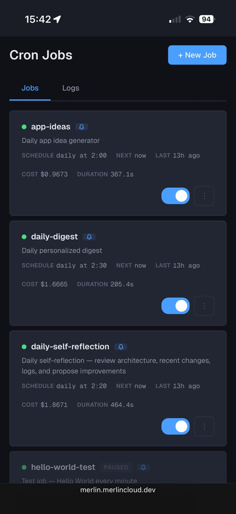
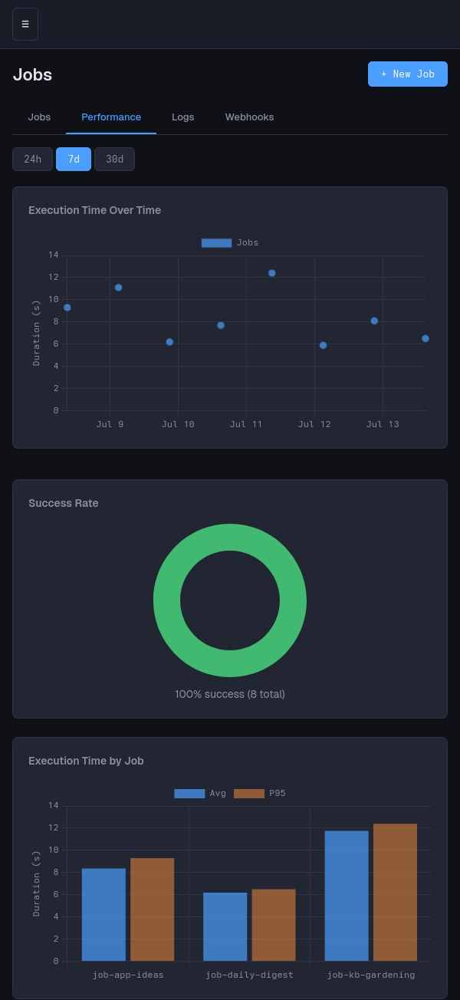

# Cron

The `/jobs` page manages Merlin's built-in scheduler. It starts with the
dashboard (no system crontab involved) and checks for due jobs every
minute. A job is either an **agent prompt** (a full agent run, the same
brain and memory as every other channel) or a **shell command** (plain
`bash -lc`, no agent, no token cost). This is the flywheel node that works
while you sleep: scheduled agent runs read and feed the
[notes and knowledge base](notes.md), then report back to Discord where
you can pick up the conversation.



The page has three tabs: Jobs, Performance, and Logs. The same jobs can
also be managed from the terminal with `merlin job`.

## See your jobs

The Jobs tab shows one card per job: a status dot (gray: never run,
green: last run succeeded, red: last run failed, exit code in the
tooltip), the job ID, an `agent` or `command` badge, a `paused` tag when
disabled, and a bell badge when Discord notifications are wired up. Below
that: the schedule in plain words, timezone, next and last run, and the
last run's cost and duration.

## Create a job

Hit **+ New Job**. Job IDs are slugs: lowercase letters, digits, single
hyphens, starting with a letter, max 30 characters (the field auto-cleans
what you type). The description is free text.

You never have to write a cron expression: pick Every N minutes, Hourly,
Daily, Weekly (day chips with Weekdays / Weekends / Every day shortcuts),
Monthly, or Custom for a raw expression. A live preview shows the
human-readable schedule, the next 3 run times in your timezone, and the
generated cron expression.

Each job has its own timezone, defaulting to your browser's. Schedules
are DST-aware: a 17:00 job stays at 17:00 wall-clock across the time
change. The server-wide default comes from `CRON_TIMEZONE`.

## Choose the action

The **Agent prompt / Shell command** toggle decides what runs:

- **Agent prompt**: a full agent run. Write the prompt as if you were
  messaging your agent.
- **Shell command**: runs in your Merlin environment via `bash -lc`. No
  agent, no token cost. stdout and stderr land in the run log.

**Working directory** is optional and applies to both types: the job's
setting, else where Merlin was launched, else `$HOME`. Point an agent job
at a project repo and it auto-loads that repo's `CLAUDE.md`.

## Set notifications

**Notify** is Always, Errors only, or Never: a Discord report after each
run, posted through the [bot](bot.md) when it is enabled. When the bot is
loaded you can override the destination channel per job; leave it empty
to use the bot's default channel.

## Agent options

Hidden for command jobs:

- **Max Turns**: cap on agent turns, 0 means unlimited.
- **Session Mode**: fresh session each run (default, recommended) or
  persistent. Fresh runs start clean, so anything worth keeping must land
  in the notes system. Persistent keeps context across runs, but costs
  grow over time.

## Save and run

**Create Job** saves it. **Save & run now** saves, fires an immediate
run, and drops you straight into that job's logs. A freshly created job
otherwise waits for its next scheduled occurrence (see troubleshooting).

## Run, pause, edit, delete

Each card has a toggle switch (off pauses the job: the scheduler skips it
and the card dims with a `paused` tag) and a three-dot menu: **Edit**
(reopens the form, the ID is locked), **Run Now** (background run, works
even on paused jobs), **View Logs** (Logs tab pre-filtered to that job),
and **Delete** (confirm dialog; removes the job and all its logs, state,
and locks).

## Read run history

The Logs tab lists runs newest-first across all jobs, with a per-job
filter: time, job, status, duration, cost. Click a row to expand the
captured output; agent runs get a **View session** link into the session
viewer for the full transcript.

## Check performance



The Performance tab charts execution time over time, success rate, and
execution time and cost by job, over a 24h / 7d / 30d range. Only agent
runs appear here: command jobs never invoke the engine, so they have no
metrics to chart (their results still show in Jobs and Logs).

## Manage from the terminal

`merlin job` covers the same jobs: add, list, get, enable, disable,
remove, trigger, history, plus the webhook trigger (webhook, url, test).
`merlin job --help` has the full reference.
One example:

```bash
merlin job add --schedule "0 7 * * *" \
  --prompt "Summarize yesterday's commits and log highlights to the KB" \
  --description "Morning digest"
```

The ID is auto-slugged from the description unless you pass one. The CLI
creates agent prompt jobs; command jobs, working directories, and per-job
timezones are set in the web UI. `merlin job trigger <id>` runs a job
immediately, bypassing the schedule; `merlin job history` shows recent
runs.

## Fire a job from outside (webhook)

Any job can be launched by an external HTTP call — an uptime monitor's
incident alert, a CI pipeline, a shortcut on your phone. In the job editor,
check **Allow firing this job via HTTP webhook** and save: Merlin generates
a secret and shows the job's public URL. A `POST` to that URL with the
secret launches the job exactly like the scheduler would:

```bash
curl -X POST -H 'X-Merlin-Webhook-Secret: whk_...' \
  https://your-instance/webhooks/job/my-job
```

If the sender cannot set headers, append `?token=whk_...` instead.
`merlin job url <id>` prints the URL, the secret, and that exact curl
command; `merlin job test <id>` fires the hook against your own server as a
dry run of the whole path.

What to know:

- **One run at a time.** A fire while a run is already active is accepted
  (HTTP 200) but coalesces into the running one — a monitor that fires five
  times during one incident launches exactly one agent.
- **Fresh session per fire.** Each webhook-launched agent run starts with a
  clean session, so two separate incidents never share context.
- **Schedule optional.** A job can have a schedule, a webhook, both, or
  neither (manual-only) — pick "No schedule" in the editor for a
  webhook-only job.
- **The secret is the key.** Anyone with the URL + secret can run the job
  (and a command job runs a shell command), so treat it like a credential.
  Rotate it anytime from the editor or `merlin job webhook <id> --rotate`;
  the old secret stops working immediately.
- **Watch the traffic.** The Logs tab shows every fire and every rejected
  attempt (wrong secret, throttled) with the caller's IP. Repeated wrong
  secrets from one IP are throttled automatically.

On Merlin Cloud, the URL rides your instance's own subdomain
(`https://{you}.merlincloud.dev/webhooks/job/{id}`) — discovered
automatically, and it follows along if you rename your environment.
Self-hosted behind your own tunnel or proxy, set `MERLIN_DASHBOARD_URL` in
`~/.merlin/config.env` to whatever address reaches your box, and the editor
and CLI will print it.

## Continue a run on Discord

A job report on Discord is not a dead end. Messages posted in a thread
attached to the report resume that exact agent session, with the run's
full context. Long reports get a thread automatically; for short ones,
start a thread on the report message. Ask follow-ups, have your agent
save findings to the knowledge base, and the next scheduled run reads
them. See [the Discord bot](bot.md).

## Mobile notes

- The create/edit form goes fullscreen on a phone (centered dialog on
  desktop), and footer buttons stack with the primary action closest to
  your thumb.
- Time and date fields open the native iOS picker, restyled to match the
  rest of the form; inputs are sized to avoid the iOS focus zoom.
- Job cards stack info above actions, and buttons and form controls
  keep comfortable touch targets.

## Troubleshooting

- **A new job did not run right away**: the scheduler registers a job the
  first time it sees it and waits for the next scheduled occurrence. Use
  Save & run now, Run Now, or `merlin job trigger` to fire it now.
- **A run was skipped, not run late**: if Merlin was down past a job's
  grace window (15 minutes by default, per-job overridable), the missed
  run is skipped and the schedule advances.
- **Red banner on /jobs**: the scheduler crashed in the last 24 hours.
  Check the logs, then dismiss.
- **"Job already running (locked)"**: a per-job lock prevents overlapping
  runs; the scheduler skips a job that is mid-run and `merlin job
  trigger` reports the lock. Wait for the current run to finish.
- **A command job exited with code 124**: command jobs are killed after
  1 hour; the run log shows "Command timed out".
- **No Discord notification**: the bot extension must be loaded and a
  channel configured, otherwise notifications are silently skipped (the
  job still runs and logs). "Errors only" skips successful runs by
  design.
- **422 when saving an edit**: switching a job's type requires filling
  the matching field (a command job needs a command, a prompt job needs a
  prompt).
- **"A job with this ID already exists"**: job IDs are unique; pick
  another.
- **Wrong timezone behavior**: an invalid per-job timezone falls back to
  the server default. An invalid server-wide `CRON_TIMEZONE` shows up as
  recurring scheduler crashes (the red banner) while schedule previews
  fall back to UTC; fix the value in `config.env`.
- **Truncated output**: the log viewer caps run output at 100KB with an
  explicit marker. Merlin keeps the last 50 execution logs and a rolling
  100-run history per job.
