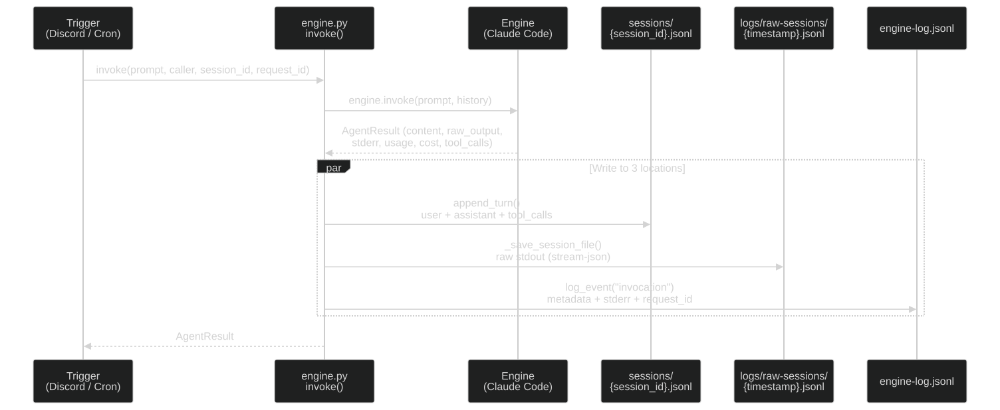

# Logging System

Merlin produces logs from multiple sources: Discord bot, cron scheduler, HTTP requests, WebSocket terminal, and tunnel lifecycle. This document explains the three logging concepts, how data flows through the system, and how rotation keeps disk usage bounded.

## Architecture

Three distinct concepts, each with its own storage:

```
~/.merlin/
├── logs/
│   ├── merlin.log              # App log (unified, rotating)
│   ├── engine-log.jsonl        # Engine lifecycle events
│   └── raw-sessions/           # Raw session recordings (session viewer)
├── sessions/                   # Session state — conversation continuity
└── cron-logs/                  # Cron execution logs
```

- **`logs/`** — observability. Everything here can be rotated or deleted without breaking the app.
- **`sessions/`** — conversation state. Persists for engine resume (not logs).
- **`cron-logs/`** — cron-specific execution records with inline output.

## Who Writes Where


([mermaid source](logging-system/producers.mmd))

### Triggers

| Trigger | What happens | Modules involved |
|---|---|---|
| **Discord message** | Bot receives message → transcribes if voice → calls `invoke()` → sends response | `merlin_bot.py`, `lib/engine.py` |
| **Cron job** | Scheduler fires → runner calls `invoke()` → writes execution log → notifies | `cron/__init__.py`, `cron/runner.py`, `lib/engine.py` |
| **HTTP request** | FastAPI handles request → file browse, auth, API, static files | `main.py`, `files/`, `notes/`, `commits/`, `auth.py` |
| **WebSocket** | Terminal session → PTY bridge → tmux | `terminal/routes.py` |
| **Tunnel lifecycle** | Cloudflare tunnel or SaaS tunnel → connect, reconnect, fail | `tunnel.py`, `saas_tunnel.py` |
| **App lifecycle** | Startup and shutdown | `main.py` |

### Unified logger hierarchy

All Python loggers use the `merlin.*` tree. The root `merlin` logger has a `RotatingFileHandler` writing to `merlin.log`. All children inherit it automatically.

```
merlin                      → merlin.log (RotatingFileHandler, 10 MB × 5)
├── merlin.bot              (Discord bot events)
├── merlin.bot.registry     (session registry)
├── merlin.terminal         (WebSocket connect/disconnect, PTY errors)
├── merlin.tunnel           (Cloudflare tunnel lifecycle)
├── merlin.saas_tunnel      (SaaS portal tunnel)
├── merlin.ssh              (SSH server events)
├── merlin.engine           (engine invocation warnings)
├── merlin.engine.claude_code
├── merlin.engine.opencode
├── merlin.cron             (cron dispatch, job execution)
├── merlin.session          (session manager)
├── merlin.claude           (legacy claude wrapper)
├── merlin.notes            (notes git operations)
├── merlin.structured_log   (log cleanup events)
└── merlin.ext.*            (extensions — see docs/extension-system.md)
    ├── merlin.ext.video_scenes
    ├── merlin.ext.video_scenes.renderer
    └── ...
```

The `RotatingFileHandler` is configured in `main.py _setup_logging()`, called at server startup. File handler level is **INFO** — DEBUG stays on console only.

Extensions get a logger injected automatically at load time (`merlin.ext.<ext_id>`), or can create sub-loggers via `from merlin_ext import get_logger`. See [extension-system.md](extension-system.md#logging) for details.

The cron runner (`cron/runner.py`) runs as a separate subprocess. When running standalone (`__main__`), it configures its own `FileHandler` to the same `merlin.log` at INFO level. When imported from the main process or tests, it inherits the parent's handler.

### Log format

**merlin.log** (text):
```
2026-03-29 10:30:45 INFO     [merlin.bot] Message from Arnaud in 1468668170599534655: hello
2026-03-29 10:30:50 INFO     [merlin.engine] Engine returned exit_code=0 duration=4.2s
2026-03-29 10:31:00 INFO     [merlin.cron] Running job weather (channel=none, max_turns=3)
```

**engine-log.jsonl** (JSONL):
```json
{"type": "invocation", "timestamp": "2026-03-29T10:30:50+00:00", "caller": "discord", "duration": 4.2, "exit_code": 0, "tokens_in": 1200, "tokens_out": 85, "cost_usd": 0.02, "model": "claude-opus-4-6", "request_id": "a1b2c3d4-...", "stderr": "", ...}
```

## Engine Invocation Data Flow

A single call to `invoke()` writes to 3 locations.


([mermaid source](logging-system/invocation-flow.mmd))

### Step by step

1. Trigger calls `invoke(prompt, caller, session_id, request_id)`
2. Engine runs the prompt, returns `AgentResult` with content, raw_output, stderr, usage, cost, tool_calls
3. Three writes happen:
   - **`append_turn()`** → `sessions/{session_id}.jsonl` — user turn, assistant turn, tool calls
   - **`_save_session_file()`** → `logs/raw-sessions/{timestamp}.jsonl` — raw stream-json dump
   - **`log_event("invocation")`** → `logs/engine-log.jsonl` — metadata + stderr + request_id

Additionally, for cron jobs:
- **`write_log()`** → `cron-logs/{job_id}/{timestamp}.json` — execution result with output

## What Each File Contains

| File | Format | Contains stdout? | Contains stderr? | Contains metadata? | Rotation |
|---|---|---|---|---|---|
| `logs/raw-sessions/*.jsonl` | JSONL | **Yes** (full, raw stream-json) | No | Yes (embedded in stream) | 90-day retention |
| `sessions/*.jsonl` | JSONL | Partial (content only) | No | Yes (duration, tokens, cost per turn) | No (state) |
| `logs/engine-log.jsonl` | JSONL | **No** | **Yes** (truncated, 500 chars) | Yes (caller, duration, exit_code, tokens, cost, model, request_id) | 180-day retention |
| `logs/merlin.log` | Text | No | Partial (error snippets) | No (free-text lifecycle events) | 10 MB × 5 backups |
| `cron-logs/job/*.json` | JSON | Partial (result.content, max 100 KB) | No | Yes (exit_code, duration, cost, session_id) | 50 per job |

### Where stdout lives

The full raw engine output (stdout) is in `logs/raw-sessions/*.jsonl` — raw stream-json from Claude Code (init events, thinking blocks, tool calls, rate limits, result). This is what the session viewer renders.

### The two session directories

| | `logs/raw-sessions/` | `sessions/` |
|---|---|---|
| **What it is** | Raw session recording — complete engine output | Session conversation — clean turn-by-turn history |
| **Content** | Raw stream-json: thinking, tool calls with I/O, rate limits, result | Clean turns: user → assistant → tool_call → tool_result |
| **Write pattern** | One new file per invocation | One file per conversation, appended to over time |
| **Consumer** | Session viewer page (`/session/`) | `engine.py` → rebuilds history for `--resume` |
| **Rotation** | 90-day retention | No (conversation state, not logs) |

### What `engine-log.jsonl` contains

Four event types that record the engine lifecycle, plus app lifecycle:

| Event type | When | Key fields |
|---|---|---|
| `bot_event` / `message_received` | Discord message arrives (before engine) | content, author, channel, request_id |
| `bot_event` / `transcription` | Voice message transcribed (before engine) | content, duration, author, request_id |
| `bot_event` / `ready` | Bot connects to Discord | details |
| `bot_event` / `error` | Something failed before/after engine | details |
| `cron_dispatch` / `started` | Cron job about to run | job_id |
| `cron_dispatch` / `completed` | Cron job finished successfully | job_id, duration, exit_code |
| `cron_dispatch` / `failed` | Cron job failed | job_id, duration, exit_code |
| `cron_runner_crash` | Cron subprocess died | exit_code, stderr |
| `invocation` | Engine ran (the actual AI call) | caller, duration, tokens, cost, model, session_id, exit_code, stderr, request_id, engine |
| `app_started` | Merlin server started | host, port, cwd, extensions |
| `app_stopped` | Merlin server stopped | — |

Pattern: **trigger → invocation → result**. The `request_id` field allows correlating a Discord message with its invocation across `merlin.log` and `engine-log.jsonl`.

### What a raw session file contains

Each file is the raw `--output-format stream-json` dump from one engine invocation:

| Event | What it is |
|---|---|
| `system/init` | Engine startup: model, tools available, CWD, session_id, permissions |
| `assistant/thinking` | The AI's internal reasoning (thinking block) |
| `assistant/text` | The AI's visible response text |
| `assistant/tool_use` | Tool call: Bash, Read, Write, Edit, Grep, etc. with full input |
| `user` | Tool results returned to the AI (one per tool_use) |
| `rate_limit_event` | API rate limit status |
| `result/success` | Final result: exit code, duration, cost, token usage breakdown |

## Who Reads What


([mermaid source](logging-system/consumers.mmd))

1. **Bot dashboard** (`/bot`, `/bot/performance`, `/bot/logs`) → reads `engine-log.jsonl` via the shared reader `lib/event_log.py:read_events()`. Powers health cards, performance charts, and log tables.
2. **Session viewer** (`/session/{filename}`) → reads `logs/raw-sessions/*.jsonl`. Renders the full timeline with thinking blocks, tool calls, token counts.
3. **Cron dashboard** (`/cron`) → reads `engine-log.jsonl` via `lib/event_log.py` for two things: the **crash banner** (`cron_runner_crash` events) and the **Performance tab**, which keeps only cron callers (`caller` starts with `cron-`) and aggregates them server-side via `perf/aggregate.py` behind `GET /api/cron/performance`. Also reads `cron-logs/` for execution history and session links.
4. **Engine resume** → reads `sessions/*.jsonl` to rebuild conversation history for `--resume`.
5. **`merlin.log`** → manual debugging only (SSH into server and read).

> **Consumer-side schema.** Writers stay free-form (`log_event(**fields)`), but every reader goes through typed Pydantic models in `lib/event_log.py` (`InvocationEvent`, `CronDispatchEvent`, `CronRunnerCrashEvent`, `BotEvent`, `AppLifecycleEvent`). Each model sets `extra="allow"`, so adding a field on the writer side never breaks a reader; lines that fail JSON decoding or model validation are skipped and counted (a single `WARNING` summary), never raised.

## Rotation

All log types have bounded growth:

| Log | Strategy | Retention | Max disk |
|---|---|---|---|
| `logs/merlin.log` | `RotatingFileHandler` | 10 MB × 5 backups | 50 MB |
| `logs/engine-log.jsonl` | Age-based cleanup at startup | 180 days | Varies |
| `logs/raw-sessions/` | Age-based cleanup at startup | 90 days | Varies |
| `cron-logs/` | Count-based per job | 50 per job | Varies |
| `sessions/` | No rotation (state) | Forever | Grows slowly |

Cleanup runs at server startup via `structured_log.cleanup_old_logs()`, called from `main.py start_server()`.

Retention constants are in `lib/structured_log.py`:
- `ENGINE_LOG_RETENTION_DAYS = 180`
- `RAW_SESSION_RETENTION_DAYS = 90`

## What is NOT logged

These parts of the app produce no structured events (though app-level errors go to `merlin.log`):

- **File browser** (`files/`) — no logging of file operations
- **Commits browser** (`commits/`) — no logging of git history views
- **Auth successes/failures** — only auto-password warning logged
- **Settings page** — configuration changes not logged
- **HTTP errors** (401, 404, 500) — no structured events, only uvicorn access log

## Files

| File | Purpose |
|---|---|
| `lib/engine.py` | Main `invoke()` entry point — writes to sessions, raw-sessions, engine log |
| `lib/structured_log.py` | `log_event()`, `cleanup_old_logs()` — engine log writer + rotation |
| `lib/event_log.py` | Canonical **reader** for `engine-log.jsonl` — typed Pydantic event models, malformed-line resilience. Used by the bot dashboard, the cron crash banner, and cron performance. |
| `perf/aggregate.py` | Pure aggregator — turns `InvocationEvent`s into chartable `PerformanceData` (no I/O; testable in isolation). |
| `lib/session.py` | `append_turn()`, `create_session()` — conversation history in `sessions/` |
| `main.py` | `_setup_logging()` — configures `merlin.*` RotatingFileHandler, calls cleanup at startup |
| `merlin-bot/merlin_bot.py` | Discord handler — writes to engine log (bot_event), generates request_id |
| `merlin-bot/merlin_app.py` | Dashboard pages — reads `engine-log.jsonl` via `lib/event_log.py`; reads `logs/raw-sessions/` directly |
| `cron/runner.py` | Cron dispatcher — writes to engine log (cron_dispatch), `cron-logs/` |
| `cron/__init__.py` | Cron scheduler — writes to engine log on crash (cron_runner_crash) |
| `cron/logs.py` | Cron execution log CRUD — reads/writes `cron-logs/`, has `cleanup_logs()` |
| `cron/routes.py` | Cron dashboard API — reads `engine-log.jsonl` via `lib/event_log.py` (crash banner + `/api/cron/performance`), `cron-logs/` for history |
| `terminal/routes.py` | Terminal WebSocket — logs connect/disconnect, PTY errors |
| `tunnel.py` | Cloudflare tunnel — logs lifecycle, restarts, URL |
| `saas_tunnel.py` | SaaS tunnel — logs connect/disconnect, port forwarding, auth |
| `ssh_server.py` | SSH server — logs host key, sessions, PTY operations |
| `notes/git_ops.py` | Notes — logs git operation failures |
