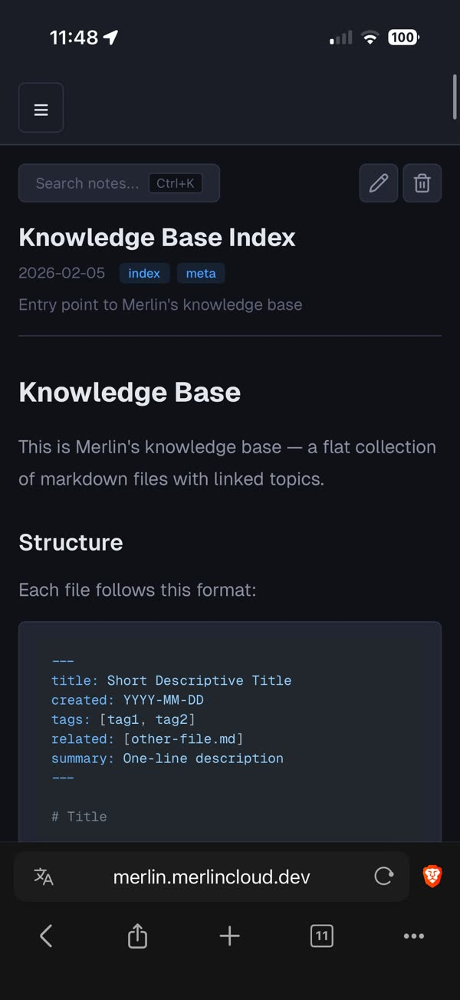

# Notes

The Notes page is a browser-based markdown editor over Merlin's notes
directory (`~/.merlin/notes` by default, `~/shared/notes` on Merlin
Cloud; `merlin config notes-dir` always prints the resolved path). This is the memory node of the flywheel:
everything here is plain markdown that your agent reads and writes from
every channel. A fact you save on this page shapes your agent's next
[job run](jobs.md) or [chat reply](bot.md), and what your agent learns
anywhere shows up here.

The directory has three layers:

- `user.md`: durable facts about you.
- `logs/YYYY-MM-DD.md`: daily logs, written by your agent as it works.
- `kb/`: a Zettelkasten-style knowledge base of atomic, interlinked notes.

Your agent acts as the curator: it writes atomic notes with tags and
related links, asks before saving during conversations, and saves
directly during scheduled runs (its operating rules are in the brain doc,
printed by `merlin agent`). Scheduled runs start fresh each time, so
anything worth keeping lands here, not in session memory. The Notes page
is your read/write window into that same tree.

## Browse your notes

Open **Notes** in the sidebar (`/notes`). The index shows your 8 most
recently modified notes, a tag cloud with per-tag counts, and a stats
line (total notes, KB count). Click any tag chip anywhere to open
`/notes/tags/{tag}`, which lists every note carrying that tag, sortable
by recent, name, or most connected.

## Search with the command palette

Press **Ctrl+K** (Cmd+K on Mac) on any notes page, or click the
"Search notes..." button. Arrow keys move, Enter opens, Escape closes.

- **Find by name**: just type. Fuzzy search over path, title, summary,
  and tags.
- **Search contents**: type `/` followed by your query (2+ characters).
  Server-side fuzzy search shows the path, line number, the matching line
  with highlighted characters, and a line of context on each side.

## Create a note

Type a new path in the palette and pick **+ Create {path}**. The editor
opens pre-filled with a frontmatter template: title derived from the
filename, today's date, empty tags, related, and summary fields.

## Read and navigate

Every note has its own URL (`/notes/{path}`). Markdown renders with
syntax-highlighted code blocks, the frontmatter shows as a styled header
(title, date, clickable tag chips, summary), and `[text](other-note.md)`
links navigate between notes, so you can walk the KB's web of links from
your phone.

## Edit, save, delete

The pencil button opens a CodeMirror editor with vim keybindings on by
default (`jj` is mapped to Escape). The **VIM/STD** toolbar button
toggles keymaps; your choice persists in localStorage. The check button
saves (green "Saved" toast), the X cancels back to view mode (or to the
index for an unsaved new note), and the trash button deletes after a
confirm dialog.

## Attach images and files

Drag and drop onto the editor. Files upload to `media/` in the notes
dir, names are slugified and deduplicated with `-1`, `-2`... suffixes,
and the image or link markdown is inserted at your cursor.

## Sync with git

On the [Extensions page](extensions.md), the Notes config exposes the
notes directory, a Git Sync toggle, a remote URL, debounce and pull
intervals, and a **Test Connection** button that checks the remote.
Saving shows "Changes require a restart to take effect" with a Restart
button: sync starts at startup.

With sync on, edits auto-commit and push in the background after the
debounce, and a periodic pull brings in changes from other devices (an
Obsidian vault on the same repo works nicely). Leave the remote URL
empty for local-only versioning.

## Work the same files from the CLI

The page and the CLI are two doors to one directory:

- `merlin notes search`: search the KB, daily logs, and tags
  (`merlin notes search --help`).
- `merlin kb add`: add a KB entry with duplicate detection, automatic
  related-note discovery, and backlinks (`merlin kb --help`).
- `merlin remember add`: append a durable fact to `user.md`;
  `merlin remember list` shows everything stored
  (`merlin remember --help`).

`merlin kb` and `merlin remember` also work as `merlin notes kb` and
`merlin notes remember`. These are the same commands your agent uses, so
[agents](agents.md) and you compound into one memory.

## Move the notes directory

Set `NOTES_DIR` (in the environment or via the Notes Directory field on
the Extensions page). `merlin config notes-dir` always prints the
resolved path.

## Mobile notes

- An upload button appears in the editor toolbar on small screens (the
  desktop path is drag-and-drop); tapping it opens your phone's file
  picker.
- The command palette goes full-width and anchors to the top of the
  screen. On the index the Ctrl+K hint is hidden; tap "Search notes..."
  to open it (note pages keep the hint; tag pages have no trigger, so
  open search from the index or a note).
- The index collapses to a single column (Recent Notes above Tags).

## Troubleshooting

- **Content search (`/`) finds nothing, ever**: `fzf` is not installed
  on the server. The content search API silently returns empty without
  it; file-name search still works because it runs in the browser.
- **Git Sync does nothing after enabling it**: saving config only writes
  it to disk. Restart Merlin (the page offers a Restart button); sync
  starts at startup.
- **Merge conflict banner** ("Merge conflict in ... edit to resolve"):
  sync committed the conflicted state so the repo is never stuck. Open
  the note, edit the `<<<<<<<` / `>>>>>>>` markers out, save: the banner
  clears on its own.
- **Pushes failing**: the sync status line on the Extensions page shows
  the last error. Use **Test Connection** there to verify the remote URL
  and credentials.
- **Failed save, delete, or upload**: a red toast shows the error detail.
  Your editor content is not lost on a failed save.
- **`merlin remember add` errors with `user.md not found`**: it never
  creates the file. Create `user.md` in the notes dir first.
- **`merlin kb add` errors**: it needs an existing `kb/` directory,
  content (flag or stdin), and `rg` (ripgrep) installed for related-note
  discovery. It also refuses to create a note that matches an existing
  filename or title; it prints the duplicates and how to proceed.
- **400 Invalid path**: note paths only accept letters, digits, dash,
  dot, underscore, and slash, and `..` is rejected.
