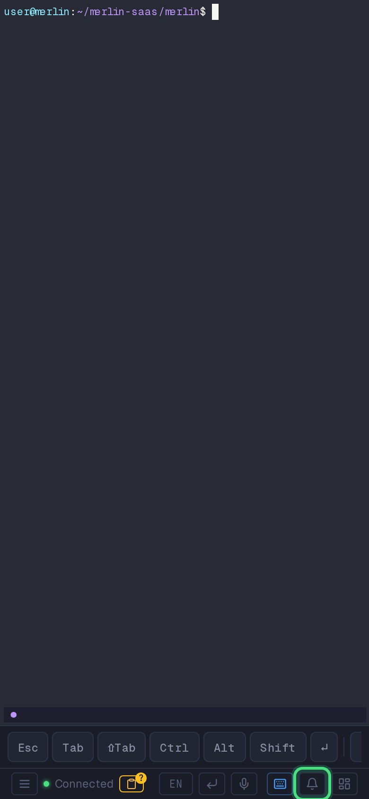
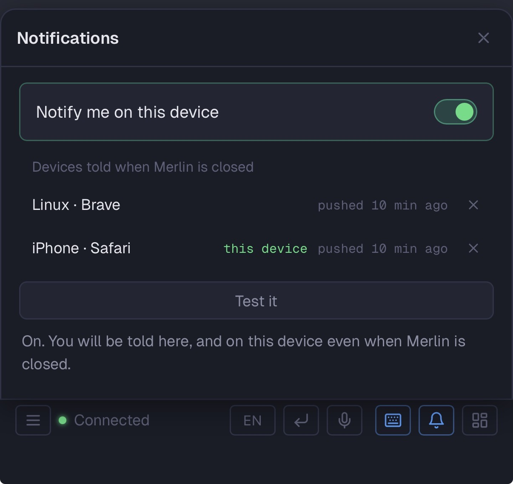

# Notifications

Merlin tells you when an agent needs you: a window flipping to **done** (the agent finished)
or **ask** (it is waiting for an answer). You get it on the desktop and on the phone, and
tapping the notification lands you in that window. Nothing is on until you turn it on.

## What you get

- **A count in the tab title and on the app icon.** `(2) worker-1 · term` means two windows
  want you. No permission needed, it is on everywhere.
- **Browser notifications while a tab is open.** One per transition, replaced (not stacked)
  when the same window flips again. Not shown for the window you are looking at, in the
  focused tab. The tab keeps notifying from the background, with the delay browsers
  impose on hidden tabs. A browser with push on gets the push instead, never both.
- **Push to your devices with the browser closed.** The instance sends a Web Push to every
  device you subscribed. Clicking it opens Merlin on that window. This is what push buys
  over the open tab: no tab needed, no background delay, and it survives sleep.

**What a notification shows.** The title is the window, the session and the environment,
most specific first: `claude · merlin-saas · sandbox`. The body says what happened:
`Finished after 14 min: All 58 tests pass, ready to commit.` or `Needs an answer: Which
branch should I deploy from?`. The duration is how long the agent worked since your last
prompt (omitted when Merlin was started after the agent went busy), and the text after the
colon is the tail of what the agent last wrote, read from its terminal pane at that moment,
at most three lines and 240 characters. That snippet is the only piece of your terminal
that leaves the machine, and Web Push encrypts it end to end with your device's keys, so
the push service relays it without being able to read it.

The signal is the same one the Sessions panel and the status-bar pills show: the tmux
`@agent_state` stamped by the agent hooks (see [Agent-state pills](terminal.md#agent-state-pills)).
Merlin sweeps it every two seconds, so a notification arrives within a couple of seconds.

## Turn it on

Open the terminal page and tap the **bell** in the bottom bar, left of the Sessions button.



One toggle, **Notify me on this device**. Turning it on asks the browser for permission
once, then does what the device allows:

- On a desktop browser or an installed phone app, you are notified while Merlin is open, and
  pushed to the device when it is not, even with the browser closed.
- Where push is not possible (an iPhone browser tab, Brave with its push setting off, plain
  HTTP), you are notified while a Merlin tab is open, and the sentence under the toggle says
  what would lift that.

Each device you turned on is listed, with a remove button, and **Send a test** sends one
notification to this device through whatever it has: a push when it is subscribed, the
tab's own notification otherwise.



Every event reaches every device you turned on, with one exception: the window you are
looking at, in a focused tab. And a notification goes away everywhere once the window
stops waiting, which is the same rule as the green pill: visit the window or leave it,
or answer the question, on any device. A phone in your pocket catches up when you next
open Merlin on it.

## Install Merlin on a phone

Every Merlin instance installs as its own app, named after the machine (`Merlin · worker-1`),
so several instances sit side by side on a home screen.

**Android (Chrome).** Open Merlin, then the browser menu, then **Add to Home screen** (or
**Install app**). Push works from the browser too, installing is a comfort.

**iPhone and iPad (Safari, iOS 16.4 or later).** Open Merlin in Safari, tap **Share**, then
**Add to Home Screen**, then open Merlin from the home screen and enable push from the bell
there. iOS delivers Web Push only to installed web apps, which is why the bell in Safari
asks you to install first.

On a phone the installed app reconnects by itself when you come back to it after a
suspension: a short absence probes the connection, a long one replaces it.

## HTTPS is required

Service workers, push and browser notifications only work in a secure context: `https://`
or `http://localhost`. On Merlin Cloud every environment is served over HTTPS already. For a
self-hosted Merlin on a LAN address over plain HTTP you still get the title count and the
pills, and the bell says why the rest is off.

The simplest way to put TLS in front of a self-hosted Merlin is a few lines of Caddy
configuration. Caddy gets
and renews the certificate on its own:

```
merlin.example.com {
    reverse_proxy localhost:3123
}
```

Point the DNS name at the machine and open port 443. Merlin itself keeps listening on
`localhost:3123`.

## Troubleshooting

- **The browser toggle is greyed out with "blocked".** The site's notification permission
  was denied at some point. Allow it in the browser's site settings (the lock icon in the
  address bar), then reload.
- **The bell says notifications need a running tmux server.** Merlin watches tmux windows,
  and none exist yet. Open the terminal once: it starts the server.
- **Plain HTTP on a LAN address.** Only the title count and the pills work. Put Merlin
  behind HTTPS (above) or use `http://localhost`.
- **Push arrives on the desktop but not on the phone.** On iPhone, open the app from the
  home screen and enable push from there, not from Safari. On Android, check the app's
  notification setting in the system settings.
- **The push toggle refuses to turn on in Brave.** Brave ships with "Use Google services
  for push messaging" off, in `brave://settings/privacy`, and Chromium browsers deliver
  Web Push only through that service. Turn it on, or keep a Merlin tab open instead: the
  tab notifies you as long as it is open.
- **A device in the list never gets a push.** Remove it and subscribe again from that
  device. A subscription the push service reports as gone is removed on its own.
- **Push is refused with `BadJwtToken` (self-hosted, iPhone or Mac).** Apple's push
  service checks that the sender names a real domain. Merlin uses the instance's public
  `https` URL when it knows it, and `https://merlincloud.dev` otherwise. Behind your own
  tunnel or reverse proxy, set `MERLIN_DASHBOARD_URL` to the public `https` URL of the
  instance (Settings, or `config.env`), then send a test again. Merlin Cloud environments
  need nothing.
- **Where the instance keeps it.** `~/.merlin/notifications/` holds the VAPID key pair and
  the subscriptions, both readable by your user only.
