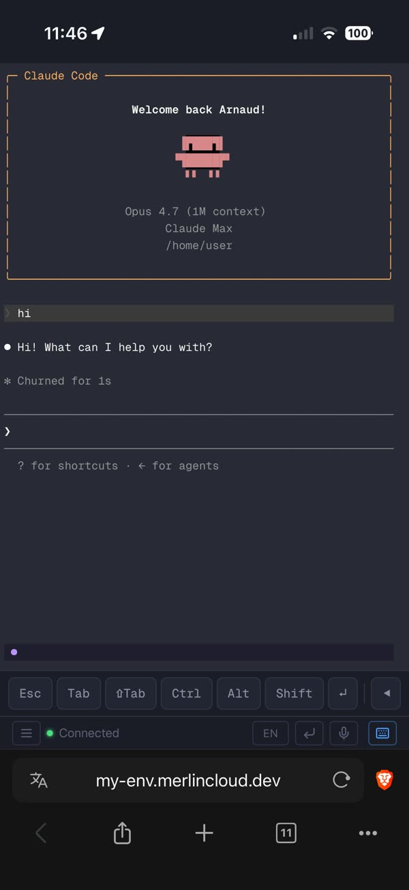
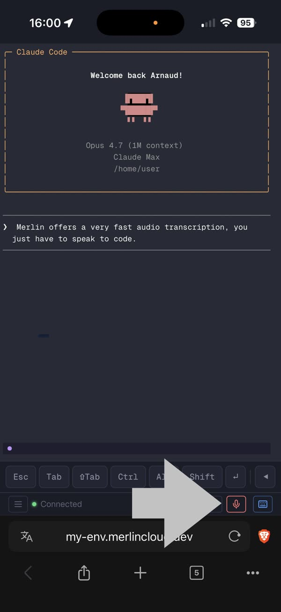

# Terminal

A full terminal in your browser at `/terminal` (same login as the rest of
the dashboard). It attaches to a persistent tmux session, so closing the
tab, losing signal, or reloading never kills your shell: reopen the page
and you are exactly where you left off. It is built for phone use: touch
gestures, a virtual key toolbar, full clipboard interop, and voice input
are all first-class.



The terminal is the heart of the coding environment: it is where you and
[your agent](agents.md) actually do the work, and what you learn here
lands in the [notes and knowledge base](notes.md) that every other
channel reads.

## Open a shell

Navigate to `/terminal`. The shell starts in the directory where `merlin`
was launched, the same directory the [file browser](files.md) and
[commits page](commits.md) operate on. A status dot in the bottom bar
shows Connecting / Connected / Disconnected; reconnection is automatic
with backoff (1s up to 30s).

## Resume after closing the tab

Nothing to do: tmux persistence handles it. On disconnect, Merlin kills
only the tmux client, never the session, and reattaches to the existing
session when you come back. Multiple browser tabs attach to the same
session, and SSH access shares it too: phone, desktop browser, and SSH
are one continuous workspace.

## Manage windows

Each tmux window is a separate shell. F2 creates a window, F3/F4 switch
to the previous/next one, F5 kills the current one. On mobile these are
the toolbar buttons `+`, `◀`, `▶`, `✕`. The tmux status bar shows windows
as dots: `●` active, `○` inactive.

The key toolbar is visible by default on touch devices and hidden on
desktop; the keyboard icon in the status bar toggles it.

## Copy and paste

Desktop copy: select with the mouse; on release the selection lands in
the OS clipboard with a "Copied!" flash. Ctrl+Shift+C copies your
selection explicitly. Ctrl+C stays SIGINT, never copy.

Paste, five ways: Ctrl+V, Ctrl+Shift+V, right-click on the terminal, the
clipboard toolbar button, or the mobile Paste pill (see mobile notes).
A "Pasted!" flash confirms; pastes are capped at 1 MB.

On macOS, paste is Cmd+V: it pastes text and images natively, with no
browser clipboard prompt. Ctrl+V is deliberately not intercepted there;
it reaches the terminal as quoted-insert (`^V`), the way native Mac
terminals treat it.

Paste an image: with an image in the clipboard, any paste path uploads it
to `/tmp/merlin-clipboard/` and types the file path into the terminal,
ready to hand to your agent. Drag-and-drop a file does the same, and the
picture toolbar button opens a file picker. Max 100 MB; uploads are
cleaned up after an hour.

## Use the clipboard from the shell

`merlin-clip` bridges the shell and the browser clipboard:

```bash
echo "hello" | merlin-clip copy   # copy to browser clipboard
merlin-clip paste                  # output last pasted text
echo "hello" | merlin-clip         # shorthand (pipe = copy)
```

tmux mouse selection is already wired to it. To make NeoVim yanks (`yy`,
visual `y`) reach your phone or desktop clipboard, add to your config:

```lua
if vim.fn.executable('merlin-clip') == 1 then
    vim.g.clipboard = {
        name = 'merlin',
        copy = { ['+'] = {'merlin-clip', 'copy'}, ['*'] = {'merlin-clip', 'copy'} },
        paste = { ['+'] = {'merlin-clip', 'paste'}, ['*'] = {'merlin-clip', 'paste'} },
    }
end
vim.o.clipboard = 'unnamedplus'
```

Outside Merlin, NeoVim falls back to the OS clipboard as usual.

## Dictate instead of typing

Tap the mic button to record, tap again to stop; the audio uploads and
the transcribed text appears in the terminal. The server injects the text
itself, so you can lock your phone right after the upload finishes.
Toggle the `↵` auto-enter button to submit transcriptions automatically,
hands-free. The EN/FR selector picks the language; both choices persist
in the browser. Recordings are capped at 25 MB.



Transcription needs a backend, picked in priority order:
[Merlin Cloud](getting-started.md#merlin-cloud) (`MERLIN_SAAS_TOKEN`,
nothing to configure), the OpenAI Whisper API
(`OPENAI_API_KEY`), or local faster-whisper (a one-time ~1.5GB model
download, works offline). `merlin setup` prompts for the OpenAI key, or append
`OPENAI_API_KEY=sk-...` to `~/.merlin/config.env`.

## Jump to commits

The branch toolbar button looks up the terminal's current directory and
opens the [commits page](commits.md) for that repo. It flashes "Not a git
repo" if you are not in one.

## Mobile notes

- Swipe vertically to scroll; tap to click and focus (which opens the
  on-screen keyboard); rotating the phone resizes the terminal.
- Drag horizontally to select text; on release a green **Copy** pill
  appears near your finger, tap it to copy. Hold a finger still for half
  a second for a blue **Paste** pill. The pills are not decoration:
  mobile browsers only allow clipboard access from a real tap.
- Modifiers are sticky: tap Ctrl, Alt, or Shift to arm it (the button
  highlights), then press a key; it applies once and clears. Esc, Tab,
  `⇧Tab`, and `↵` send immediately. Arrow keys repeat when held.
- Voice survives bad connectivity: recordings are saved locally before
  upload and the upload retries three times with backoff.

## Troubleshooting

- **Clipboard does nothing / "Clipboard blocked" flash**: the Clipboard
  API requires HTTPS, so use your tunnel URL, not plain http. On mobile,
  use the pills or the toolbar buttons. `/clipboard-test` is the built-in
  diagnostic page.
- **Clipboard icon with `?` or red `✕` in the status bar**: the browser
  permission is unset or denied. Click the icon to trigger the prompt; if
  red, enable clipboard access in your browser settings. On Safari and
  Firefox the icon stays hidden (no persistent permission there); every
  paste just needs a tap.
- **Mic button with a yellow `!` badge**: no transcription backend is
  configured; set `OPENAI_API_KEY` or `MERLIN_SAAS_TOKEN`.
- **Voice over plain HTTP**: fails with "[Voice requires HTTPS — mic API unavailable over HTTP]"; and
  "[Microphone permission denied]" means the browser blocked mic access.
- **Voice upload failed (yellow pulsing mic)**: the recording is kept
  locally and survives a page reload; tap the mic to retry once you have
  signal.
- **"Copied — Ctrl+Shift+C for system"**: the automatic clipboard write
  was blocked; press Ctrl+Shift+C to copy the same text explicitly.
- **"Unauthorized — reload page"**: your session cookie expired; reload
  and log in again.
- **"Terminal unavailable"**: tmux is not installed on the host; the page
  shows the install command.
